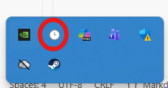
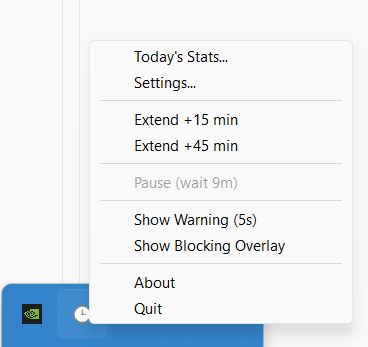
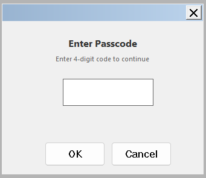
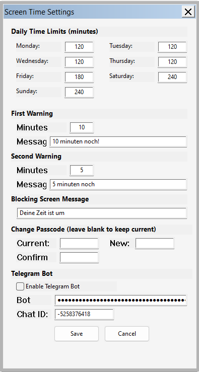
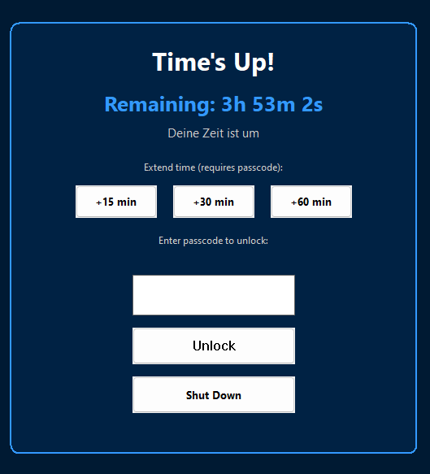

# Screen Time Manager

A simple Windows app to manage your child's computer time. Set daily limits, and when time's up, the screen is blocked until you enter the passcode.

No complicated setup. No special accounts needed. Just run it and configure your limits.

Confirmed to be effectively blocking Fortnite, Roblox and Minecraft.

---

## What It Does

- **Daily Time Limits** - Set different limits for each day (e.g., 2 hours on school days, 4 hours on weekends)
- **Timer Display** - A small timer in the corner shows remaining time
- **Warnings** - Alerts your child before time runs out ("10 minutes left!")
- **Screen Block** - When time's up, the screen is blocked until you enter the passcode
- **Extra Time** - Grant +15, +30, or +60 minutes when needed
- **Pause Feature** - Kids can pause the timer for breaks (with built-in limits to prevent abuse)
- **Shut Down Option** - Shut down the computer directly from the lock screen
- **Works on All Monitors** - Blocks all connected screens

---

## Getting Started

1. **Run the app** - Double-click to start. A small timer appears in the top-right corner.

2. **Find the tray icon** - Look for the clock icon in the system tray (bottom-right of your screen, near the clock).

   

3. **Open the menu** - Right-click the tray icon to see all options.

   

4. **Open Settings** - Click "Settings..." and enter the passcode (default is `0000`).

   

5. **Configure your limits** - Set daily time limits, warning messages, and optionally set up Telegram remote control.

   

6. **Change the passcode** - Use the "Change Passcode" section to set something your child won't guess!

---

## When Time Runs Out

A "Time's Up!" screen appears that blocks the entire computer.

- **Extend buttons** (+15, +30, +60 min) - Enter passcode to grant more time
- **Unlock button** - Enter passcode to remove the block completely
- **Shut Down button** - Shut down the computer (with confirmation)

---

## The Pause Feature

Your child can pause the timer for meals, homework, or breaks without needing your passcode.

**Built-in limits prevent abuse:**
- 45 minutes total pause time per day
- Each pause auto-resumes after 20 minutes
- Must wait 15 minutes between pauses

You can view pause usage in "Today's Stats..." from the tray menu.

---

## Viewing Stats

Right-click the tray icon and select "Today's Stats..." to see:
- Time used today
- Time remaining
- Pause usage
- Option to reset the timer

---

## Remote Control via Telegram (Optional)

You can monitor and control screen time from your phone using Telegram. This is useful when you're not near the computer.

**What you can do from Telegram:**
- `/status` - Check remaining time and pause status
- `/time` - Quick time check
- `/extend 30` - Add extra time (e.g., 30 minutes)
- `/pause` - Pause the timer
- `/resume` - Resume the timer
- `/history` - See today's pause activity

**Setup (one-time):**

1. Open Telegram and search for **@BotFather**
2. Send `/newbot` and follow the steps to create your bot
3. Copy the **bot token** you receive
4. Start a chat with your new bot and send `/start`
5. Note your **chat ID** shown in the reply
6. In Screen Time Manager settings, scroll to "Telegram Bot" section
7. Paste your bot token and chat ID, then enable the bot

Once configured, only you can control the bot - it ignores messages from anyone else.

---

## Tips

- **Change the default passcode** - The default `0000` is easy to guess!
- **Set reasonable limits** - Too strict and kids get frustrated; too loose and they won't learn limits
- **Check stats occasionally** - See if pause mode is being used appropriately
- **The timer survives restarts** - Restarting the computer won't reset the timer

---

## Making It Start Automatically

To have Screen Time Manager start when Windows boots:

1. Press `Win + R` on your keyboard
2. Type `shell:startup` and press Enter
3. Copy the Screen Time Manager app into this folder (or create a shortcut to it)

Now it will start automatically every time the computer turns on.

---

## Requirements

- Windows 10 or Windows 11
- That's it!
